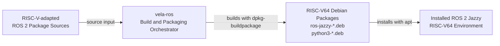

## Vela ROS Build and Packaging Flow

`vela-ros` builds RISC-V64-compatible Debian packages from ROS 2 Jazzy package sources and RISC-V-adapted repositories.



- **Input:** ROS 2 Jazzy package sources and RISC-V64-adapted repositories
- **Build system:** `vela-ros`
- **Build artifacts:** RISC-V64 Debian package files (`.deb`)
- **Operational result:** An installed ROS 2 Jazzy environment for RISC-V64

# Prepare
The user have to run qemu-vela ahead and log in. Then, run the script below.

The log in script should output something like this:
-------------------------------------------------------
R9 login: vela
Welcome to Ubuntu 24.04 LTS (GNU/Linux 6.8.0-31-generic riscv64)

 * Documentation:  https://help.ubuntu.com
 * Management:     https://landscape.canonical.com
 * Support:        https://ubuntu.com/pro
```
vela@R9:~$
```
This confirms that the user is currently running with user privileges for the vela account.

# Check your guest
User have to check the commuication status in this guest env by
```
$sudo apt update
```

Run prepare.sh once initially to set up the system for vela-ros.

```
$./prepare.sh
```

# Build and install ROS2

Run vela-ros for building and installing ros2.

```
$./vela-ros
```

To install specific packages in order, pass package names directly.

```
$./vela-ros ros-jazzy-rclcpp ros-jazzy-ros-base
```

It will take long times(about more than 6 hours). Please be patient.
